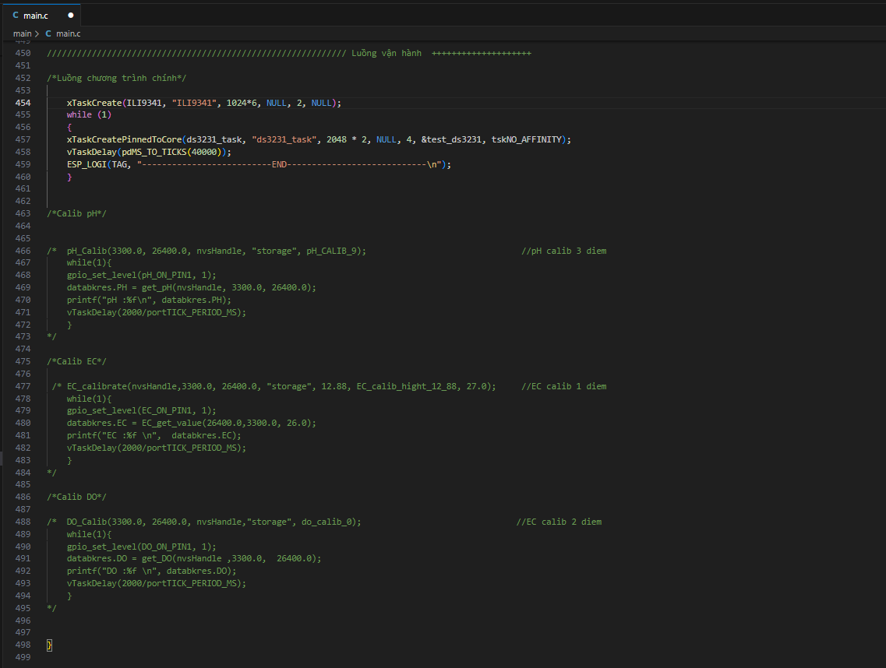

Cài đặt idf phiên bản 5.1 hoặc 5.0 

-----------------------Start -------------------------

B1: MỞ cmd esp-idf và điều hướng đến thư mục đang lưu dự án
B2: Dùng lệnh: idf.py fullclean
B3: Đùng lệnh: idf.py set-target esp32s3
B4: Dùng lệnh: idf.py menuconfig
B5: Thực hiện cấu hình như trong ảnh 

B6: Chạy lệnh: idf.py -p "COMX" flash monitor  // X là số COM trong máy 

---------------Calib trong code như sau: ------------------------

- Trong file main di chuyển đến 

Ta comment  /*Luồng chương trình chính*/

* Đối với pH 

Mở dòng code calib pH và thực hiện calib ( !pH cần calib 3 điểm )

B1: 
    - Trong câu lệnh /*  pH_Calib(3300.0, 26400.0, nvsHandle, "storage", pH_calib_X);  */
      + Trong đó: X là 3 biến đại diện cho 3 dung dịch pH ( pH_calib_4, pH_calib_6.86, pH_calib_9)
    - Lấy thông số dung dịch nào chọn biến tương ứng dung dịch đó

B2: Build lại code và từ monitor cmd có được giá trị sau khi đo đạc 

eg: I (363) pH TAG: Gia tri can luu lai la: 239999 

B3: Lấy giá trị 239999  lưu vào biến nhớ  _pH_X_voltage (X là số) trong file mypH.c

B4: Quay lại B1 đến khi calib xong 

* Đối với DO

Mở dòng code calib DO và thực hiện calib ( !DO cần calib 2 điểm )

B1: 
    - Trong câu lệnh /*  DO_Calib(3300.0, 26400.0, nvsHandle,"storage", do_calib_X);   */
      + Trong đó: X là 2 biến đại diện cho 2 dung dịch DO ( do_calib_0, do_calib_100)
    - Lấy thông số dung dịch nào chọn biến tương ứng dung dịch đó

B2: Build lại code và từ monitor cmd có được giá trị sau khi đo đạc 

eg: I (363)  DO TAG: Gia tri can luu lai la: 239999 

B3: Lấy giá trị 239999  lưu vào biến nhớ  DO_VX (X là số) trong file myDO.c

B4: Quay lại B1 đến khi calib xong 

* Đối với EC

Mở dòng code calib EC và thực hiện calib ( !DO calib 1 điểm )

B1: Build lại code và từ monitor cmd có được giá trị sau khi đo đạc 

eg: I (363)  DO TAG: Gia tri can luu lai la: 239999 

B2: Lấy giá trị 239999  lưu vào biến nhớ  EC_kvalueHigh trong file myDO.c

Sau khi calib xong mở lại luồng chương trình chính và đóng lại các câu lệnh calib 
